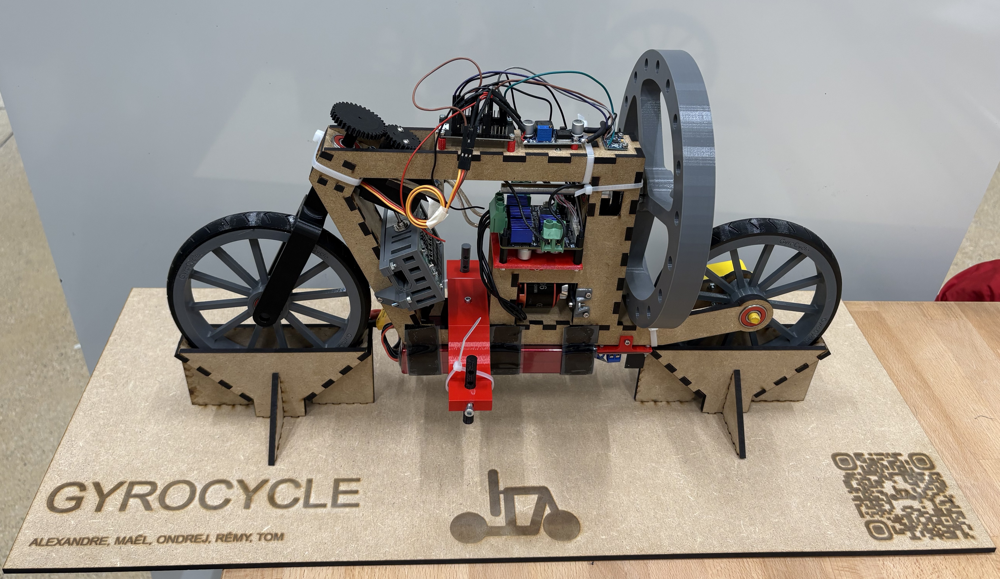

# GyroCycle

Welcome to the GyroCycle project's repo!

GyroCycle is a project of building a self-balancing bicycle as part of the [CS-358 course at EPFL](https://edu.epfl.ch/coursebook/en/making-intelligent-things-a-CS-358-A).

This is the result we came up with:



Our complete documentation is available as a Vitepress website in the `docs` directory, although the repository is private for now, so it can't be published as a GitHub Pages website just yet.

For now, if you want to read the documentation, you can either

- Read the markdown files in `docs`, but some of them won't be readable because they use some dynamic `Vue.js` components that won't be displayed in the markdown preview.

- Run the documentation website locally on your machine.

## Hosting the documentation locally

Ensure you have [NodeJS](https://nodejs.org/en) installed, and run the following commands (assuming you're using NPM). Note that errors such as `ReferenceError: window is not defined` are to be expected, but the build should still succeed.

```
git clone https://github.com/epfl-cs358/2024fa-gyrocycle gyrocycle

cd gyrocycle/docs

npm i

npm run docs:build

npm run docs:preview
```

Open the URL displayed in the terminal after the last command in your browser. You should be able to access the documentation website locally.
