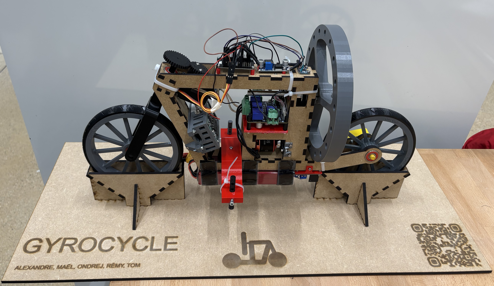

# GyroCycle

Welcome to the GyroCycle project's repo!

GyroCycle is a project of building a self-balancing bicycle as part of the [CS-358 course at EPFL](https://edu.epfl.ch/coursebook/en/making-intelligent-things-a-CS-358-A).

This is the result we came up with:

We documented our results along with how to reproduce the build on our [documentation website](https://epfl-cs358.github.io/2024fa-gyrocycle/).

Happy building !

The GyroCycle team.
